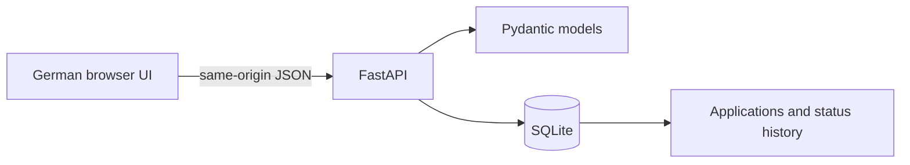

# Bewerbungs-Tracker

**A clear next step for every application.** A local-first job application tracker with a German web interface, a Python API and real database persistence.

Built as a learning and portfolio project for Mahdi Roustaei Chamkakaei. The initial implementation was created with AI assistance (OpenAI Codex); it is intended to be studied, extended and explained through subsequent hands-on work. It is not a university assignment or evidence of prior professional Python experience.

## What it does

- Create and edit company, role, location, job URL, application date, follow-up date and notes.
- Track six statuses: **Vorgemerkt → Beworben → Im Gespräch → Zusage**, plus Absage and Zurückgezogen. Changes are recorded in a separate status history.
- Search company, role and location; combine the search with a status filter.
- See totals, interviews, offers and overdue/today follow-ups on a dashboard.
- Archive and restore applications without permanently deleting them.
- Export **all applications, including archived ones**, as UTF-8 CSV with spreadsheet formula neutralization.
- Keep data in a local SQLite database across restarts. No browser-only persistence, account, telemetry or external AI API.

## Run locally

Requires **Python 3.12+**. Tested with Python 3.12. Node is only needed for development tests, not for running the app.

Download this repository through GitHub's **Code → Download ZIP**, extract it and open a terminal inside the project directory.

### macOS / Linux

```bash
python3 -m venv .venv
source .venv/bin/activate
python -m pip install -r requirements.txt
python -m uvicorn main:app --host 127.0.0.1 --port 8000
```

### Windows PowerShell

```powershell
py -3.12 -m venv .venv
.\.venv\Scripts\python.exe -m pip install -r requirements.txt
.\.venv\Scripts\python.exe -m uvicorn main:app --host 127.0.0.1 --port 8000
```

Open **http://127.0.0.1:8000**. Stop with `Ctrl+C`.

API reference: **http://127.0.0.1:8000/docs**. Read-only requests work directly; writes require the verification header described below.

### Optional fictional demo

Before starting the server, run the following in your activated environment:

```bash
python seed_demo.py
```

On Windows use `.\.venv\Scripts\python.exe seed_demo.py`.

This inserts six **fictional** examples with dates relative to today. It refuses to alter a nonempty database. No real application emails, employers' feedback or personal correspondence are included in the repository.

## Docker

Requires Docker with the Compose plugin.

```bash
docker compose up --build -d
```

Open http://127.0.0.1:8000. The container runs as a non-root user and uses a persistent named volume. The published port is bound to localhost.

```bash
# Optional demo, only for an empty database
docker compose exec tracker python seed_demo.py
# Stop; keep the database volume
docker compose down
```

Do not add `--volumes` to the stop command if you want to keep your data. Docker is configured for Europe/Berlin. Direct Python execution uses the host's timezone when determining which follow-ups are due.

## Architecture and decisions



| File | Responsibility |
| --- | --- |
| `main.py` | App factory, HTTP routes, statistics, CSV and request protection |
| `models.py` | Validation rules and typed API contracts |
| `database.py` | Schema initialization, connection lifecycle and parameterized filters |
| `index.html`, `styles.css`, `app.js` | Responsive, keyboard-accessible client without a build step |
| `seed_demo.py` | Opt-in fictional examples; refuses to overwrite existing data |
| `test_tracker.py` | API, persistence, validation and safety regression tests |
| `test_ui.mjs` | DOM-level client tests with mocked HTTP responses |
| `.github/workflows/ci.yml` | Python checks, DOM tests and Docker build on pushes/PRs |

**Why SQLite?** This is a single-user local application. One portable database file keeps setup simple and makes SQL behavior visible while learning. Database operations use bound parameters and transactions; each request closes its own connection.

**Why plain JavaScript?** The interface is small enough to keep its state and HTTP flow explicit. No frontend build process is needed to use the app. User-supplied text is inserted with `textContent`, not `innerHTML`.

**Why archive?** Applications can be restored, avoiding accidental permanent deletion. Status history is independent of archiving. Editing other fields does not create a fake status transition.

## API examples

```bash
curl http://127.0.0.1:8000/api/health
curl 'http://127.0.0.1:8000/api/applications?status=applied&q=Hannover'
curl -X POST http://127.0.0.1:8000/api/applications \
  -H 'Content-Type: application/json' \
  -H 'X-Requested-With: BewerbungsTracker' \
  -d '{"company":"Example GmbH","role":"Werkstudent Backend","status":"saved"}'
```

| Method | Endpoint | Purpose |
| --- | --- | --- |
| GET | `/api/health` | Server and database readiness |
| GET | `/api/applications` | Search/filter (`q`, `status`, `archived`, `due`) |
| POST | `/api/applications` | Create an application |
| GET / PUT | `/api/applications/{id}` | Read / replace editable fields |
| PATCH | `/api/applications/{id}/archive` | `{"archived": true}` or `false` |
| GET | `/api/applications/{id}/history` | Status changes, oldest first |
| GET | `/api/stats` | Counts for all non-archived applications |
| GET | `/api/export.csv` | Export all records, including archives |

Missing records return `404`; invalid input returns `422`. Company and role are required. Status and dates are validated. Only HTTP(S) job URLs without embedded credentials are accepted. All write requests need `X-Requested-With: BewerbungsTracker`; this is **CSRF mitigation, not authentication**. Cross-origin browser writes are rejected.

## Development and checks

```bash
python -m pip install -r requirements-dev.txt
ruff check .
pytest
# Optional client DOM tests, Node 22.22.2 or Node 24.15.0+
npm ci
npm test
```

Initial local verification: **23 Python test cases and 5 client DOM tests passed**, plus JavaScript syntax and Ruff checks. The Python tests use disposable databases and verify persistence across app restarts, validation, history, archive/restore, literal search, due-date logic, CSV safety and write/host protection. The client tests cover empty state, text rendering, create/edit, archive/restore and connection errors.

DOM tests do not test layout or a real browser. A real-browser end-to-end visual check and a local Docker execution were not available in the creation environment. CI includes a Docker build; check the Actions tab for the current result rather than assuming it passed.

## Data, backups and limits

- Default database: `data/tracker.sqlite3`. Set `TRACKER_DB` to choose another path.
- For a complete backup, stop the app and copy the database file. CSV is for viewing/export and does not include status history or support automatic restore.
- No login or multi-user separation. **Run this version locally; do not expose it to the public internet.** Public hosting requires authentication, access control, HTTPS and a reviewed deployment design.
- The interface performs full-list loading and last-write-wins edits. It is intended for one person's application list, not concurrent team use.
- Basic search uses SQLite's built-in case folding (ASCII); full Unicode case-insensitive search is a future improvement.
- Follow-ups are in-app reminders. No email is sent and Gmail is not connected.
- Schema version 1 is initialized automatically. Future schema changes need explicit migrations.
- Core package versions are pinned; indirect dependencies are not fully locked.

## Next learning milestones

1. Run the app, follow one request from form to database and explain the status-history transaction.
2. Add a feature personally (e.g. contact person or interview date), including validation and tests.
3. Add real-browser end-to-end tests and screenshots at desktop/mobile sizes.
4. Explore PostgreSQL and migrations; add authentication before considering shared hosting.

For an interview, distinguish the AI-assisted initial implementation from changes you have personally understood, implemented and verified.

References: [FastAPI lifespan](https://fastapi.tiangolo.com/advanced/events/), [FastAPI testing](https://fastapi.tiangolo.com/tutorial/testing/), [Python sqlite3](https://docs.python.org/3/library/sqlite3.html).
